# Recipehub

## Milestone Project -03 - _Data Centric Development_ - Code Institute


## User Experience

### User Stories

As a Visitor (Not Logged In):

+ I want to be able to explore recipes by cuisine.
+ I want to search for recipes based on ingredients or titles.
+ I want to be able to view the details of a recipe without logging in.


As a Registered User:

+ I want to be able to log in to the application.
+ I want to be able to log out of the application.
+ I want to be able to add a new recipe, including details like title, cuisine, ingredients, and preparation steps.
+ I want to be able to edit or delete the recipes I've added.
+ I want to be able to like recipes.
+ I want to be able to share recipes on social media.
+ I want to be able to comment on recipes.
+ I want to see how many recipes I've contributed on my profile page.
+ I want to see a list of all the recipes I've added.
+ I want the application to be responsive and easy to use on my mobile device.

Site Owner:

+ I want to see which recipes are the most popular.
+ I want users to see suggestions for my brand's kitchen tools when adding required tools to a recipe.
+ I want to be able to feature certain recipes on the homepage.


### Design

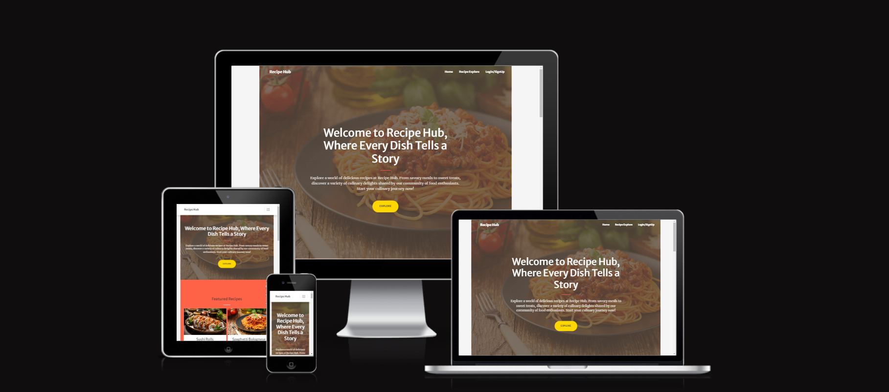

#### Colour Scheme

# Cookbook Website Color Palette

In designing the Recipe Hub website, a carefully selected color palette has been chosen to evoke a sense of warmth, freshness, and elegance. The following color scheme is applied across the website for a cohesive and visually appealing experience:

## Colors:

1. **Primary Color: #FF6347 (Tomato)**
   - This vibrant red-orange color symbolizes the richness and warmth of cooked dishes.

2. **Secondary Color: #8F9779 (Sage)**
   - A muted green reminiscent of herbs and fresh ingredients, adding a natural and earthy feel.

3. **Accent Color: #FFD700 (Gold)**
   - Used this warm gold color for highlights and call-to-action buttons, bringing a touch of elegance.

4. **Background Color: #F5F5F5 (Silver)**
   - A light, neutral grayish background enhances readability and creates a clean, modern look.

5. **Text Color: #333333 (Charcoal)**
   - A dark charcoal color is used for text, providing high contrast against the light background for easy reading.


#### Typography

# Font Family Configuration for Headings and Body

In the CSS stylesheet, the `font-family` property has been defined to ensure a consistent and visually appealing typography across different heading levels and the body of the HTML document. The chosen font stack prioritizes specific fonts while providing fallback options for compatibility across various platforms.

## Heading Levels (h1 to h6)

- **h1, .h1**
- **h2, .h2**
- **h3, .h3**
- **h4, .h4**
- **h5, .h5**
- **h6, .h6**

For the above heading levels, the following font-family hierarchy has been established:

1. **"Merriweather Sans"**: This is the preferred font for headings, providing a clean and modern appearance.

2. **-apple-system, BlinkMacSystemFont**: These are system fonts for Apple devices and Blink-based browsers, ensuring a seamless and native look on these platforms.

3. **"Segoe UI"**: A Windows system font, contributing to a consistent experience for users on Windows operating systems.

4. **Roboto**: A widely used and versatile sans-serif font that serves as a reliable fallback on various platforms.

5. **"Helvetica Neue", Arial, "Noto Sans"**: Additional sans-serif options that cater to different operating systems and browsers.

6. **sans-serif**: A generic sans-serif font to cover cases where none of the specified fonts are available.

## Body

For the overall body text of the document, the same font stack is applied, promoting a cohesive and harmonious design throughout the website.


### Wireframes

[Landing page Mobile](./recipehub/static/assets/wireframes/mobile-home.jpg)

[Recipe Explore page Mobile](./recipehub/static/assets/wireframes/mobile-recipe-explore.jpg)

[Add and Edit page Mobile](./recipehub/static/assets/wireframes/mobile-add-edit.jpg)

[profile page Mobile](./recipehub/static/assets/wireframes/mobile-profile.jpg)

[view Recipe page Mobile](./recipehub/static/assets/wireframes/mobile-recipe.jpg)

[Landing page tablet](./recipehub/static/assets/wireframes/tablet-home.jpg)

[Recipe Explore page tablet](./recipehub/static/assets/wireframes/tablet-recipe-explore.jpg)

[Add and Edit page tablet](./recipehub/static/assets/wireframes/add-edit-recipe.jpg)

[profile page tablet](./recipehub/static/assets/wireframes/tablet-profile.jpg)

[view Recipe page tablet](./recipehub/static/assets/wireframes/tablet-recipe.jpg)

[Landing page Desktop](./recipehub/static/assets/wireframes/home-page.jpg)

[Recipe Explore page Desktop](./recipehub/static/assets/wireframes/recipe-explore-page.jpg)

[Add and Edit page Desktop](./recipehub/static/assets/wireframes/Add-edit-recipe.jpg)

[profile page Desktop](./recipehub/static/assets/wireframes/profile-page.jpg)

[view Recipe page Desktop](./recipehub/static/assets/wireframes/recipe-view-page.jpg)


## Features

### Existing Features


1. Navigation Bar

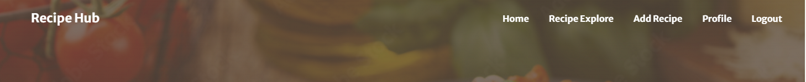

+ Welcome to Recipe Hub, your go-to platform for all things recipes! Explore a world of culinary delights and discover new dishes.
Clicking on the logo will smoothly navigate you to the top of the current page, providing a convenient way to quickly access the top of the content.
Utilize the navigation bar to seamlessly navigate to relevant pages. Find what you're looking for with ease, and enjoy the diverse range of recipes at your fingertips.

2. Sign Up

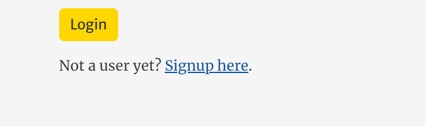

+ If you're not a registered user, clicking on  Sign up page and join our community of food enthusiasts!


3. Explore 


+ If you click on the "Explore", it will take you to the Recipe Explore page, where you can discover a variety of exciting recipes. 

4. Featured recipes in home page

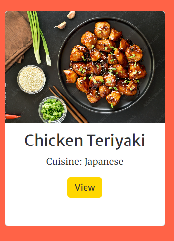

+ Discover our "Featured Recipes" section to explore popular and trending dishes on the platform. Find inspiration and try out some of the most loved recipes by our community!

5. Get in touch 

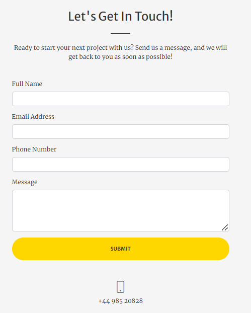

+ If you have any inquiries or feedback, please fill out the contact form.We appreciate your engagement and look forward to hearing from you!

6. Social Icons

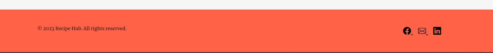

+ Look for our social icons to navigate to our official social media pages. Follow us  and join the conversation, share your favorite recipes, and be part of our vibrant community.
We love connecting with our users, and your support means the world to us!

7. Search bar in expore recipes

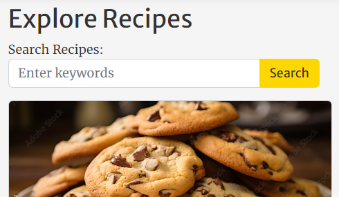

+Discover recipes quickly and efficiently using our powerful search bar. Simply enter keywords,  and let our platform find the perfect recipes for you. Enhance your culinary experience with Recipe Hub's easy-to-use search functionality.
Happy cooking!

8. Filter in select cuisine

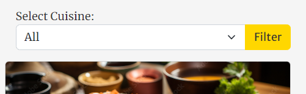

+ Easily narrow down your recipe choices by filtering them based on cuisine preferences. Whether you're in the mood for Italian, Mexican, or Asian flavors, our platform has you covered. Use the "Filter" feature to customize your recipe browsing experience and discover the perfect dish for any occasion.

9. Modify recipes

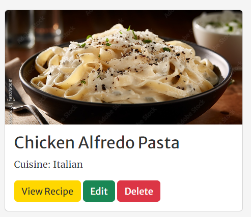

+ Recipes can be modified by the admin, the recipe owner, or any registered user. 
Enjoy the freedom to make each recipe your own and share your culinary creativity with the Recipe Hub community!

10.   Add a  cuisine type

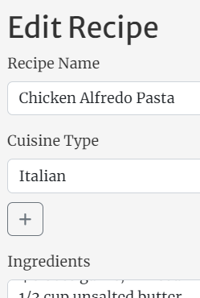

+ Recipe Hub values the richness of various cuisines from around the globe. If you have a unique cuisine you'd like to contribute, follow the ''Add'' feature to add a new cuisine type.

11.  Add a new tool 

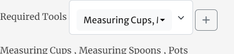

+ At Recipe Hub, we believe in the power of innovation and collaboration. If you have a favorite kitchen tool that's not in our current collection, you can contribute by adding a new tool.

12.  Save changes 

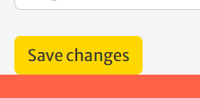

+ After modifying a recipe, ensure your updates are preserved by using the "Save Changes" feature. Whether you're the admin, the recipe owner, or a registered user making adjustments, simply click the "Save Changes" button to update the recipe with your modifications.
We value your culinary contributions, and saving changes ensures that your personalized touch is reflected in the Recipe Hub community. 

13.  Add recipe

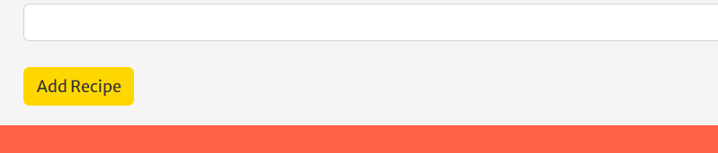

+ Have a unique recipe you'd like to share with the Recipe Hub community? Click on the "Add Recipe" to start the process. 

14.  User information

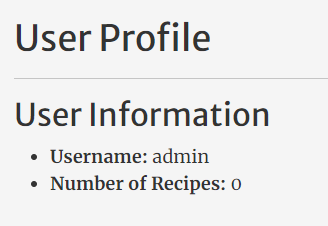

+ Easily access information about your Recipe Hub profile:
- **User Name:** See your unique username displayed for a personalized experience.
- **Number of Recipes:** Track the number of recipes you've contributed to the platform.

15.  Manage data

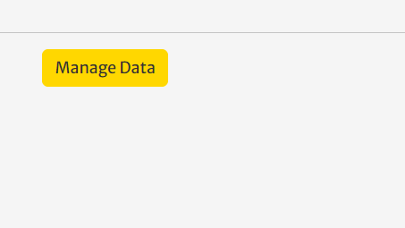

+ As a user on Recipe Hub, you have the ability to manage your data efficiently:

16.  View messages 

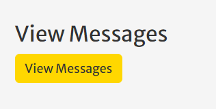

+ For administrators, Recipe Hub provides a dedicated section to view messages.
Efficiently manage and respond to user messages to foster a supportive and engaging community.

17.  Add cuisine and tools

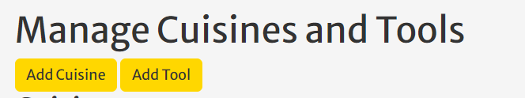

+ As a user on Recipe Hub, you have the ability to contribute to the platform's diversity by managing cuisines and tools:
- **Add Cuisine:** Introduce a unique culinary style to our platform by Clicking on "Add Cuisine"
- **Add Tool:** Share your favorite kitchen tools with the community by Clicking on "Add Tool".

18.  Cuisines

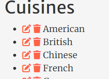

+ Modify existing cuisines to reflect changes or improvements. Click on "Edit Cuisine," make the necessary adjustments, and save the changes. Click on "Delete Cuisine" to remove a cuisine from our collection.

19.  Tools

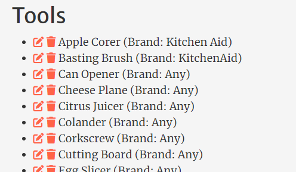

+ **Edit Tool:** Modify existing tools to reflect changes or improvements. Click on "Edit Tool," make the necessary adjustments, and save the changes.
- **Delete Tool:** Remove tools that are no longer relevant or accurate. Click on "Delete Tool" to remove a tool from our collection.


### Future Features


#### Share on Social Media

Allow users to share their favorite recipes on various social media platforms.

#### Recipe Comments

Enable users to leave comments on recipes to share their thoughts, tips, or modifications.

#### Instant Update for Tools and Cuisines

Implement a feature that dynamically adds new tools or cuisines to the database without requiring a page reload when added from the add or edit recipe page.

## Technologies Used

+ **Google Chrome Dev Tools:** Used for debugging.
+ **Google Lighthouse:** Utilized for audits.
+ **Git:** Source control for version management.
+ **VS Code:** Integrated Development Environment (IDE) for coding.
+ **CodeAnywhere:** Online IDE for collaborative development.
+ **W3C Validator:** Used for HTML validation.
+ **Jigsaw Validator:** Used for CSS validation.
+ **JSHint:** Used for JavaScript validation.
+ **Python Validator:** [PEP8CI](https://pep8ci.herokuapp.com/) for Python code style validation.
+ **Heroku:** Deployment platform for hosting the application.
+ **SQLAlchemy ORM:** Object-Relational Mapping for Python.
+ **ElephantSQL:** Database server for PostgreSQL.
+ **PostgreSQL:** Relational database management system.
+ **Psycopg2:** PostgreSQL adapter for Python.
+ **jQuery:** JavaScript library for simplifying HTML DOM traversal and manipulation.
+ **Flask:** Micro web framework for Python.

### Languages Used

+ HTML5
+ CSS3
+ Java Script
+ Python

### Frameworks, Libraries, and Programs Used

1. **Bootstrap Icons**
   - **Source:** [Bootstrap Icons](https://cdn.jsdelivr.net/npm/bootstrap-icons@1.5.0/font/bootstrap-icons.css)
  
2. **Google Fonts**
   - **Fonts:** Merriweather Sans (400, 700), Merriweather (400, 300, 300italic, 400italic, 700, 700italic)
   - **Source:** [Google Fonts](https://fonts.googleapis.com/css?family=Merriweather+Sans:400,700) and [Google Fonts](https://fonts.googleapis.com/css?family=Merriweather:400,300,300italic,400italic,700,700italic)

3. **SimpleLightbox Plugin**
   - **Version:** 2.1.0
   - **Source:** [SimpleLightbox](https://cdnjs.cloudflare.com/ajax/libs/SimpleLightbox/2.1.0/simpleLightbox.min.css) and [SimpleLightbox](https://cdnjs.cloudflare.com/ajax/libs/SimpleLightbox/2.1.0/simpleLightbox.min.js)

4. **Bootstrap**
   - **Version:** 4.6.2
   - **Source:** [Bootstrap](https://cdn.jsdelivr.net/npm/bootstrap@4.6.2/dist/js/bootstrap.bundle.min.js)

5. **Font Awesome**
   - **Version:** 5 (Free)
   - **Source:** [Font Awesome](https://kit.fontawesome.com/937ad0d044.js)

6. **jQuery**
   - **Version:** 3.7.1
   - **Source:** [jQuery](https://code.jquery.com/jquery-3.7.1.js)

7. **Bootstrap Select**
   - **Version:** 1.13.1
   - **Source:** [Bootstrap Select CSS](https://cdnjs.cloudflare.com/ajax/libs/bootstrap-select/1.13.1/css/bootstrap-select.min.css) and [Bootstrap Select JS](https://cdnjs.cloudflare.com/ajax/libs/bootstrap-select/1.13.1/js/bootstrap-select.min.js)

8. **SQLAlchemy ORM**
   - **Source:** [SQLAlchemy](https://www.sqlalchemy.org/)

9. **Flask**
   - **Source:** [Flask](https://flask.palletsprojects.com/)
  
10. **Jinja**
- **Source:** [Jinja](https://jinja.palletsprojects.com/en/3.0.x/)
  - Templating language I've used with Python to add logic to my html templates.


## Testing

### Validator Testing

Validation is done throughout the development and all the error and warnings are fixed.

following validators have been used to validate HTML and CSS codes.

### <em>HTML Validator</em>

+ [W3C validator](https://validator.w3.org/) used for HTML validating

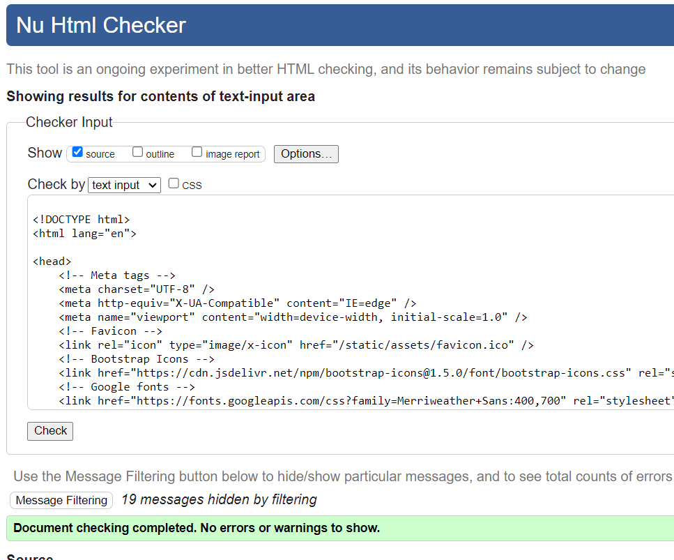

### <em>CSS Validator</em>

+ [CSS validation](https://jigsaw.w3.org/css-validator/) used for CSS validation

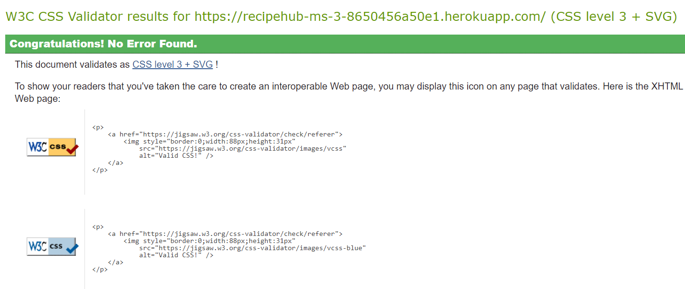

### <em>Java Script Validator</em>

+ [JSHint Validator](https://jshint.com/) used for CSS validation

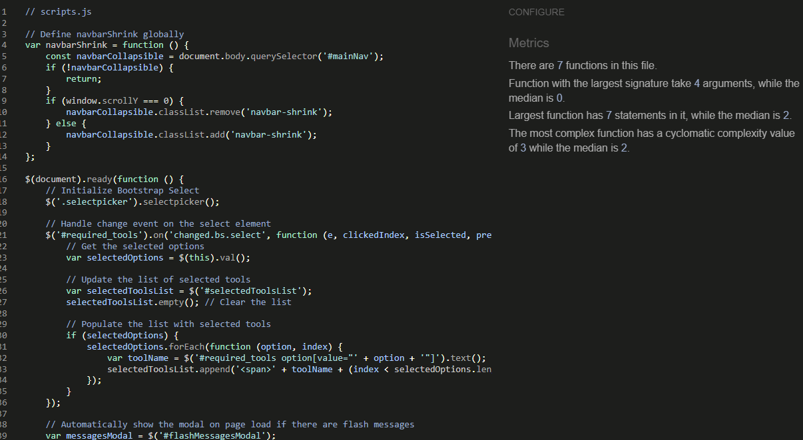

### <em>Python Validator</em>

+ [PEP8CI Validator](https://pep8ci.herokuapp.com/) used for CSS validation

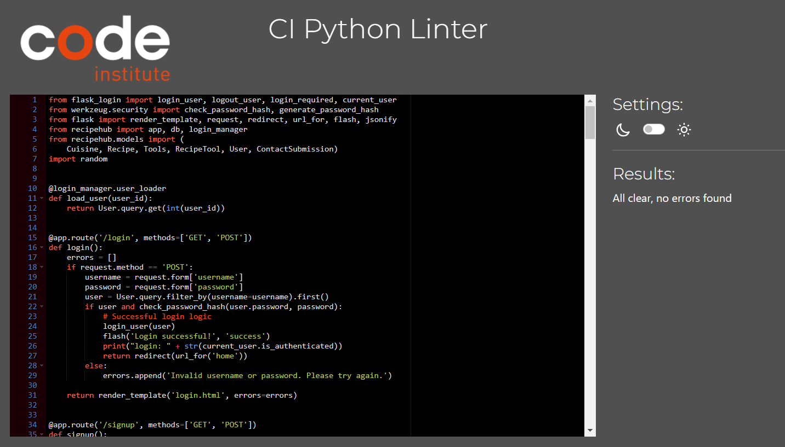


### Responsiveness

| Page Name       | Desktop View       | Tablet View        | Mobile View        |
|-----------------|--------------------|--------------------|--------------------|
| Add Recipe      | [Link](./recipehub/static/assets/responsiveness/desktop-add-recipe.png)          | [Link](./recipehub/static/assets/responsiveness/ipad-add-recipe.png)          | [Link](./recipehub/static/assets/responsiveness/iphone-se-add-recipe.png)          |
| Edit Recipe     | [Link](./recipehub/static/assets/responsiveness/desktop-edit-recipe.png)          | [Link](./recipehub/static/assets/responsiveness/ipad-edit-recipe.png)          | [Link](./recipehub/static/assets/responsiveness/iphone-se-edit-recipe.png)          |
| Home            | [Link](./recipehub/static/assets/responsiveness/desktop-home.png)          | [Link](./recipehub/static/assets/responsiveness/ipad-home.png)          | [Link](./recipehub/static/assets/responsiveness/iphone-se-home.png)          |
| Login           | [Link](./recipehub/static/assets/responsiveness/desktop-login.png)          | [Link](./recipehub/static/assets/responsiveness/ipad-login.png)          | [Link](./recipehub/static/assets/responsiveness/iphone-se-login.png)          |
| Manage data     | [Link](./recipehub/static/assets/responsiveness/desktop-manage-data.png)          | [Link](./recipehub/static/assets/responsiveness/ipad-manage-data.png)          | [Link](./recipehub/static/assets/responsiveness/iphone-se-manage-data.png)          |
| View Messages   | [Link](./recipehub/static/assets/responsiveness/desktop-messages.png)          | [Link](./recipehub/static/assets/responsiveness/ipad-view-recipe.png)          | [Link](./recipehub/static/assets/responsiveness/iphone-se-messages.png)          |
| Profile         | [Link](./recipehub/static/assets/responsiveness/desktop-profile.png)          | [Link](./recipehub/static/assets/responsiveness/ipad-profile.png)          | [Link](./recipehub/static/assets/responsiveness/iphone-se-profile.png)          |
| Recipe Explore  | [Link](./recipehub/static/assets/responsiveness/desktop-recipe-explore.png)          | [Link](./recipehub/static/assets/responsiveness/ipad-recipe-explore.png)          | [Link](./recipehub/static/assets/responsiveness/iphone-se-recipe-explore.png)          |
| Signup          | [Link](./recipehub/static/assets/responsiveness/desktop-sign-up.png)          | [Link](./recipehub/static/assets/responsiveness/ipad-sign-up.png)          | [Link](./recipehub/static/assets/responsiveness/iphone-se-sign-up.png)          |
| View Recipe     | [Link](./recipehub/static/assets/responsiveness/desktop-view-recipe.png)          | [Link](./recipehub/static/assets/responsiveness/ipad-view-recipe.png)          | [Link](./recipehub/static/assets/responsiveness/iphone-se-view-recipe.png)          |


### Testing Accessibility and Performance

I used google lighthouse to check Accessibility and Performance.

|                    | Performance | Accessibility | Best Practices | SEO |
| ------------------ | ----------- | ------------- | -------------- | --- |
| [Add Recipe/Desktop view](./recipehub/static/assets/accessibilty/desktop-add-recipe.png)      | 97%         | 100%          | 100%           | 89% |
| [Add Recipe/Mobile view](./recipehub/static/assets/accessibilty/mobile-add-recipe.png)       | 71%         | 100%          | 100%           | 91% |
| [Edit Recipe/Desktop view](./recipehub/static/assets/accessibilty/desktop-edit-recipe.png)      | 96%         | 100%          | 100%           | 89% |
| [Edit Recipe/Mobile view](./recipehub/static/assets/accessibilty/mobile-edit-recipe.png)       | 72%         | 100%          | 100%           | 91% |
| [Home/Desktop view](./recipehub/static/assets/accessibilty/desktop-home.png)      | 84%         | 100%          | 100%           | 90% |
| [Home/Mobile view](./recipehub/static/assets/accessibilty/mobile-home.png)       | 70%         | 100%          | 100%           | 92% |
| [Login/Desktop view](./recipehub/static/assets/accessibilty/desktop-login.png)      | 91%         | 100%          | 100%           | 89% |
| [Login/Mobile view](./recipehub/static/assets/accessibilty/mobile-login.png)       | 72%         | 100%          | 100%           | 91% |
| [Manage data/Desktop view](./recipehub/static/assets/accessibilty/desktop-manage-data.png)      | 96%         | 94%          | 100%           | 89% |
| [Manage data/Mobile view](./recipehub/static/assets/accessibilty/mobile-manage-data.png)       | 64%         | 94%          | 100%           | 91% |
| [View Messages/Desktop view](./recipehub/static/assets/accessibilty/desktop-messages.png)      | 94%         | 100%          | 100%           | 89% |
| [View Messages/Mobile view](./recipehub/static/assets/accessibilty/mobile-messages.png)       | 73%         | 100%          | 100%           | 91% |
| [Profile/Desktop view](./recipehub/static/assets/accessibilty/desktop-profile.png)      | 94%         | 100%          | 100%           | 89% |
| [Profile/Mobile view](./recipehub/static/assets/accessibilty/mobile-profile.png)       | 75%         | 100%          | 100%           | 91% |
| [Recipe Explore/Desktop view](./recipehub/static/assets/accessibilty/desktop-recipe-explore.png)      | 94%         | 100%          | 100%           | 90% |
| [Recipe Explore/Mobile view](./recipehub/static/assets/accessibilty/mobile-recipe-explore.png)       | 71%         | 100%          | 100%           | 92% |
| [Signup/Desktop view](./recipehub/static/assets/accessibilty/desktop-sign-up.png)      | 96%         | 100%          | 100%           | 89% |
| [Signup/Mobile view](./recipehub/static/assets/accessibilty/mobile-sign-up.png)       | 77%         | 100%          | 100%           | 91% |
| [View Recipe/Desktop view](./recipehub/static/assets/accessibilty/desktop-view-recipe.png)      | 98%         | 100%          | 100%           | 90% |
| [View Recipe/Mobile view](./recipehub/static/assets/accessibilty/mobile-view-recipe.png)       | 77%         | 100%          | 100%           | 92% |


### Testing User Stories

#### As a Visitor (Not Logged In):

- I can explore recipes by cuisine.
- I can search for recipes based on ingredients or titles.
- I can view the details of a recipe without logging in.

#### As a Registered User:

- I can log in to the application.
- I can log out of the application.
- I can add a new recipe, including details like title, cuisine, ingredients, and preparation steps.
- I can edit or delete the recipes I've added.
- I can see how many recipes I've contributed on my profile page.
- I can see a list of all the recipes I've added.
- I can use the application on my mobile device as it is responsive and easy to navigate.

#### Site Owner:

- I can see which recipes are the most popular.
- I can present users with suggestions for my brand's kitchen tools when they add required tools to a recipe.
- I can feature certain recipes on the homepage.


### Problems Encountered

#### before

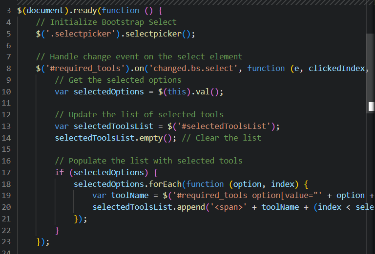
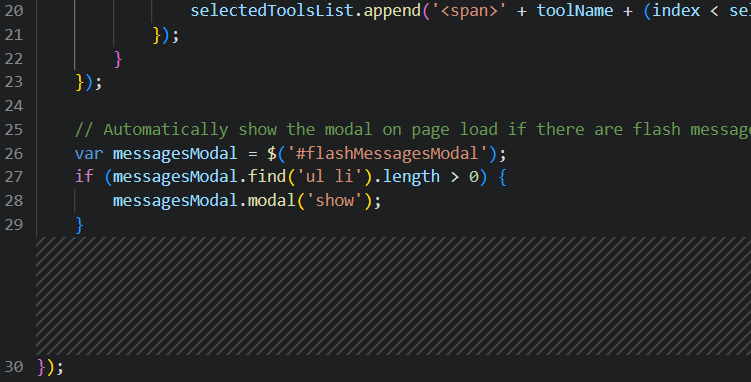
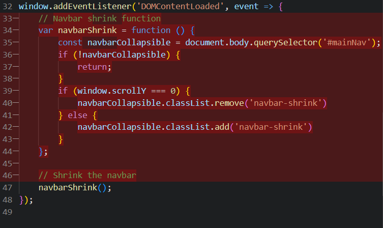


I attempted to modify the background color of the navbar while scrolling down, but the JavaScript code I used for this purpose was not effective. Consequently, I had to define the navbar shrink function from the event listener and call it later within the DOM event listener.

#### debug

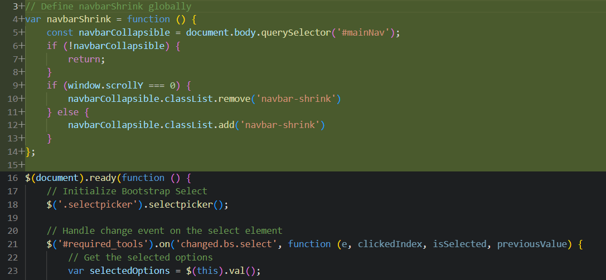
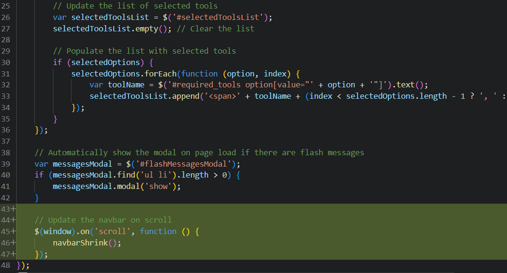

## Deployment


### Creating a Gitpod Workspace

The project was created in Gitpod using the Code Institute Gitpod Full Template using these steps:

1. Log in to GitHub and go to the [Code Institute student template for Gitpod](https://github.com/Code-Institute-Org/gitpod-full-template)
2. Click 'Use this Template' next to the Green Gitpod button.
3. Add a repository name and click 'Create reposiory from template'.
4. This will create a copy of the template in your own repository. Now you can click the green 'Gitpod' button to open a workspace in Gitpod.

### Forking the GitHub Repository

To Fork a Github Repository:

1. Log in to GitHub and go to the [GitHub Repository](https://github.com/Isabella-Mitchell/gather-recipe-website)
2. Locate the Fork button in the top-right corner of the page, click Fork.
3. You should now have a copy of the original repository in your GitHub account.

### Making a Local Clone

You will now have a fork of the repository, but you don't have the files in that repository locally on your computer.

To make a local clone:

1. Log in to GitHub and go to the [GitHub Repository](https://github.com/hpatnadeeshan/MS-3)
2. Above the list of files, click  Code.
3. To clone the repository using HTTPS, under "Clone with HTTPS", click the 'Copy' icon. To clone the repository using an SSH key, including a certificate issued by your organization's SSH certificate authority, click Use SSH, then click the 'Copy' icon. To clone a repository using GitHub CLI, click Use GitHub CLI, then click the 'Copy' icon.
4. Open Git Bash.
5. Change the current working directory to the location where you want the cloned directory.
6. Type git clone, and then paste the URL you copied earlier. It will look like this, with your GitHub AE username instead of YOUR-USERNAME:

```
$ git clone https://github.com/YOUR-USERNAME/YOUR-REPOSITORY
```

7. Press Enter. Your local clone will be created.

```
$ git clone https://github.com/YOUR-USERNAME/YOUR-REPOSITORY
```

### Creating an application with Heroku

You will need to deploy the application using Heroku.

1. Create a requirements.txt file by typing ``` pip3 freeze --local > requirements.txt ``` into the Gitpod CLI. Ensure this is added to your .gitignore file.
2. Create a Procfile by typing ```echo web: python app.py > Procfile```. Open it and ensure it doesn't have a new line, as this can create errors. Ensure it starts with a capital P.
3. Add and commit these files to Github.
4. Go to [Heroku](https://dashboard.heroku.com/apps). Log in or create an account
5. Click the 'New' button and click 'Create new app'.
6. Enter a unique name for your project with no capital letters or spaces and select your region. Click 'Create App'.
7. Inside your project, go to the Resources tab and create a Heroku Postgres Database
8. Inside your project, go to the 'Settings' tab. Scroll down and click 'Reveal Config Vars'.
9. Add in the following variables
  - IP : 0.0.0.0
  - PORT : 5000
  - MONGO_DBNAME : Your database name
  - MONGO_URI : TSQL link to the relational database
  - SECRET_KEY : Your secret key
10. Deploy your project by going to the Deploy tab and choose 'Connect to Github'
11. Find your repository name and select Connect.
12. To connect your Heroku database, go to 'More' in the top right and select run console. Enter ```python3``` to access the python intepreter.
13. Then type ```from recipehub import db,app```. Then type ```db.create_all()```. You can then exit the console.

## Admin credentials/ Superuser credentials

+ username- admin
+ password-12345678
  
## Credits

### Code

1. Startbootstrap theme used to build the website and highly customized(https://startbootstrap.com/previews/creative).
2. Bootstrap framework used for modal, flexbox and responsiveness,, cards, portfolio boxes,forms throughout the website.
3. Bootstrap select use for multple selection in drop down list.
4. code institute mini projects inspirations were taken throghout the project.
5. YouTube and google inspiration was taken for some sections.

### Media

1. Icons and footer icons were taken from Font Awesome and bootstrap Icons.
2. Google Fonts used in the website
3. jQuery library used throughout the code.
4. w3schools was used as a general source of knowledge
5. https://github.com/Isabella-Mitchell/gather-recipe-website/edit/main/README.md for deployment.


### Acknowledgements

+ Creating a README(How to put together a well-documented README for your projects) by Code Institute
+ I would like to acknowledge my mentor Rory Patrick for his review and valuable feedback throughout the project.
+ I would like to thank my wife for testing the application and feedback.

## Disclaimer

This project was developed for educational purposes as part of the Code Institute's Data Centric Development module.
